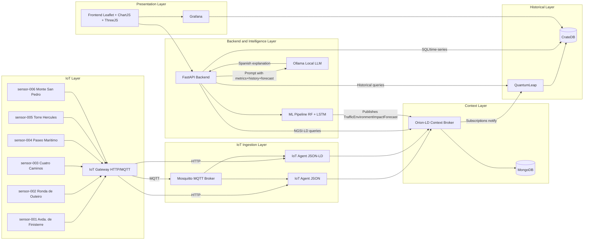
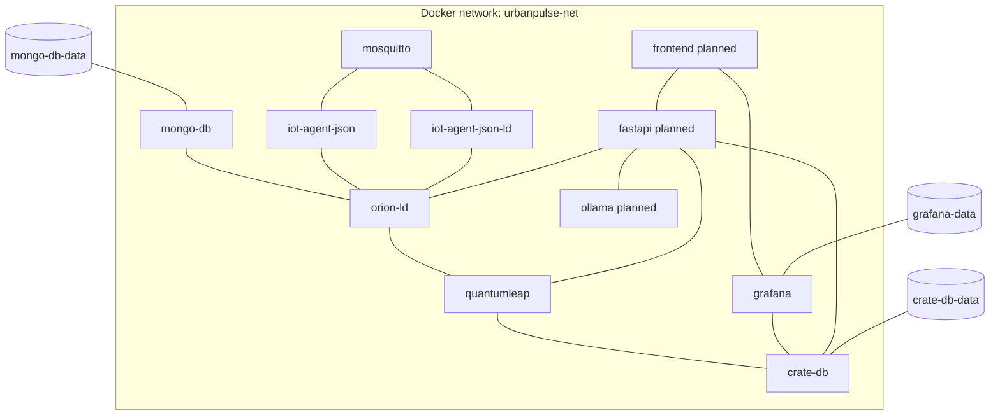

# Architecture - UrbanPulse Coruna

## 1. Vision de arquitectura

UrbanPulse Coruna implementa una arquitectura FIWARE NGSI-LD en capas para monitorizacion ambiental urbana, analitica historica, prediccion y explicacion local.

Capas objetivo:
- IoT
- IoT Agent JSON
- Orion-LD
- QuantumLeap + CrateDB
- FastAPI backend
- Frontend + Grafana

La plataforma mantiene dos niveles de referencia:
- Estado desplegado actual: servicios presentes en docker-compose + backend FastAPI (Issue #3).
- Arquitectura objetivo: incluye frontend y Ollama para completar todas las funcionalidades del contexto.

## 2. Diagrama de arquitectura completo (Mermaid)



## 3. Componentes y rol

## 3.1 Capa IoT
- Sensores urbanos (sensor-001 a sensor-006): capturan flujo de trafico, calidad del aire y ruido en puntos reales de A Coruna.
- IoT Gateway HTTP/MQTT: emisor de telemetria por protocolo HTTP o MQTT.

## 3.2 Capa de ingesta IoT
- Mosquitto: broker MQTT para telemetria publish/subscribe.
- IoT Agent JSON: traduce payload de dispositivo a entidades NGSI-LD en Orion-LD.
- IoT Agent JSON-LD: variante de agente para flujos adicionales con configuracion diferenciada.

## 3.3 Capa de contexto
- Orion-LD: broker central de entidades NGSI-LD, consultas y suscripciones.
- MongoDB: persistencia subyacente del estado de contexto gestionado por Orion-LD.

## 3.4 Capa historica
- QuantumLeap: consume notificaciones de Orion-LD y persiste series temporales.
- CrateDB: almacenamiento de series historicas y consultas analiticas para dashboards.

## 3.5 Capa backend e inteligencia
- FastAPI backend (objetivo): API de negocio para frontend, agregacion de datos y reglas de alertado.
- Pipeline ML (scikit-learn + TensorFlow): entrenamiento/inferencia para forecast 6/12/24h.
- Ollama local con modelo Mistral: explicaciones en espanol basadas en estado actual, historico y prediccion.

## 3.6 Capa de presentacion
- Frontend (objetivo): interfaz ciudadana y tecnica con Leaflet, ChartJS y ThreeJS.
- Grafana: analitica historica embebida conectada a CrateDB.

## 4. Flujos de datos

## 4.1 Ingesta IoT por HTTP
1. Sensor o gateway envia medida por HTTP a IoT Agent (`7896` o `7897`).
2. IoT Agent transforma payload al modelo NGSI-LD correspondiente.
3. IoT Agent actualiza/crea entidad en Orion-LD (`1026`).
4. Orion-LD persiste estado en MongoDB.

## 4.2 Ingesta IoT por MQTT
1. Sensor publica en broker Mosquitto (`1883`).
2. IoT Agent consume topico MQTT configurado.
3. IoT Agent normaliza telemetria y publica en Orion-LD.
4. Estado contextual actualizado en tiempo real.

## 4.3 Suscripciones Orion -> QuantumLeap
1. Orion-LD mantiene suscripciones para entidades relevantes.
2. Ante cambios, Orion notifica a QuantumLeap (`8668`).
3. QuantumLeap serializa eventos temporales en CrateDB (`5432`/`4200`).
4. Grafana y backend consumen historico para analisis.

## 4.4 Consultas NGSI-LD desde FastAPI
1. Frontend invoca endpoint de FastAPI.
2. FastAPI consulta Orion-LD para estado actual de entidades NGSI-LD.
3. FastAPI combina respuesta con historico cuando aplica.
4. Frontend renderiza mapa, graficas y paneles.

## 4.5 Pipeline ML (scikit-learn/LSTM)
1. FastAPI extrae historico temporal desde CrateDB/QuantumLeap.
2. FastAPI incorpora contexto actual desde Orion-LD.
3. Pipeline ML ejecuta inferencia para horizontes 6h, 12h y 24h.
4. FastAPI publica entidades `TrafficEnvironmentImpactForecast` en Orion-LD.
5. Frontend consume prediccion y banda de confianza.

## 4.6 Integracion Ollama LLM local
1. FastAPI prepara contexto: metricas actuales + historico 6h + forecast.
2. FastAPI llama a Ollama local (`11434`) con prompt en espanol.
3. Ollama responde explicacion causal y evolucion esperada.
4. FastAPI entrega informe y, si aplica, dispara alerta simulada.

## 5. Puertos y URLs por servicio

## 5.1 Servicios actuales (docker-compose + .env)

| Servicio | Contenedor | Puerto host -> contenedor | URL host | URL interna docker |
|---|---|---|---|---|
| MongoDB | urbanpulse-mongo-db | 27017 -> 27017 | mongodb://localhost:27017 | mongodb://mongo-db:27017 |
| Orion-LD | urbanpulse-orion-ld | 1026 -> 1026 | http://localhost:1026 | http://orion-ld:1026 |
| Mosquitto | urbanpulse-mosquitto | 1883 -> 1883 | mqtt://localhost:1883 | mqtt://mosquitto:1883 |
| IoT Agent JSON North | urbanpulse-iot-agent-json | 4041 -> 4041 | http://localhost:4041 | http://iot-agent-json:4041 |
| IoT Agent JSON HTTP | urbanpulse-iot-agent-json | 7896 -> 7896 | http://localhost:7896 | http://iot-agent-json:7896 |
| IoT Agent JSON-LD North | urbanpulse-iot-agent-json-ld | 4042 -> 4042 | http://localhost:4042 | http://iot-agent-json-ld:4042 |
| IoT Agent JSON-LD HTTP | urbanpulse-iot-agent-json-ld | 7897 -> 7897 | http://localhost:7897 | http://iot-agent-json-ld:7897 |
| CrateDB HTTP | urbanpulse-crate-db | 4200 -> 4200 | http://localhost:4200 | http://crate-db:4200 |
| CrateDB PSQL | urbanpulse-crate-db | 5432 -> 5432 | psql://localhost:5432 | psql://crate-db:5432 |
| QuantumLeap | urbanpulse-quantumleap | 8668 -> 8668 | http://localhost:8668 | http://quantumleap:8668 |
| Grafana | urbanpulse-grafana | 3000 -> 3000 | http://localhost:3000 | http://grafana:3000 |

## 5.2 Servicios objetivo para arquitectura completa

| Servicio | Puerto recomendado | URL host | URL interna docker |
|---|---:|---|---|
| FastAPI backend | 8000 | http://localhost:8000 | http://fastapi:8000 |
| Frontend web | 5173 | http://localhost:5173 | http://frontend:5173 |
| Ollama local | 11434 | http://localhost:11434 | http://ollama:11434 |

## 6. Variables de entorno necesarias (.env)

## 6.1 Variables actuales detectadas

```dotenv
MONGO_VERSION=6.0
MONGO_DB_PORT=27017
ORION_LD_PORT=1026
MQTT_PORT=1883
IOTA_NORTH_PORT=4041
IOTA_HTTP_PORT=7896
CRATE_VERSION=latest
CRATE_HTTP_PORT=4200
CRATE_PSQL_PORT=5432
QUANTUMLEAP_VERSION=latest
QUANTUMLEAP_PORT=8668
GRAFANA_VERSION=latest
GRAFANA_PORT=3000
GRAFANA_ADMIN_USER=admin
GRAFANA_ADMIN_PASSWORD=admin
```

## 6.2 Variables recomendadas para completar arquitectura objetivo

```dotenv
IOTA_NORTH_PORT_LD=4042
IOTA_HTTP_PORT_LD=7897

FASTAPI_PORT=8000
FRONTEND_PORT=5173
OLLAMA_PORT=11434
OLLAMA_MODEL=mistral:7b

ORION_BASE_URL=http://orion-ld:1026
QUANTUMLEAP_BASE_URL=http://quantumleap:8668
CRATEDB_HTTP_URL=http://crate-db:4200
CRATEDB_HOST=crate-db
CRATEDB_PSQL_PORT=5432

MQTT_HOST=mosquitto
MQTT_PORT=1883
```

## 7. Diagrama de despliegue Docker Compose (Mermaid)



## 8. Notas de implementacion

- Orion-LD, IoT Agents, Mosquitto, QuantumLeap, CrateDB y Grafana estan definidos en docker-compose.
- FastAPI backend esta implementado (Issue #3) con endpoints REST, integracion NGSI-LD, ML y LLM.
- Frontend y Ollama se documentan como componentes objetivo para cerrar el alcance funcional completo.
- La arquitectura mantiene consistencia NGSI-LD en todas las rutas de datos.

## 9. Implementaciones Completadas

### Issue #3: Backend FastAPI con ML y LLM
- ✅ Endpoints REST completos (sensors, impact, forecast, alerts, explain)
- ✅ Integración NGSI-LD con Orion-LD
- ✅ Consultas a QuantumLeap/CrateDB para historicos
- ✅ Pipeline ML con RandomForest para predicción 6/12/24h
- ✅ Explicaciones en español con Ollama Mistral local
- ✅ CORS habilitado para frontend
- ✅ Configuración por variables de entorno
- Localización: `backend/`

## 9. Implementacion base (Issue #1)

### 9.1 Configuracion operativa
- Se usa `.env` como fuente de configuracion de puertos, versiones y credenciales.
- `docker-compose.yml` incorpora `restart: unless-stopped` y `healthcheck` por servicio base.
- Las dependencias entre servicios se definen con condicion de salud para mejorar el arranque.

### 9.2 Validacion de servicios
- Script de comprobacion: `services/healthcheck.sh`.
- Verifica contenedores activos y endpoints HTTP de Orion-LD, IoT Agent JSON, QuantumLeap, CrateDB y Grafana.

### 9.3 Historizacion Orion -> QuantumLeap
- Payload de suscripcion: `services/subscriptions/orion_to_quantumleap_all_entities.json`.
- Script idempotente de provision: `services/create_orion_subscription.sh`.
- Endpoint de notificacion interno: `http://quantumleap:8668/v2/notify`.
