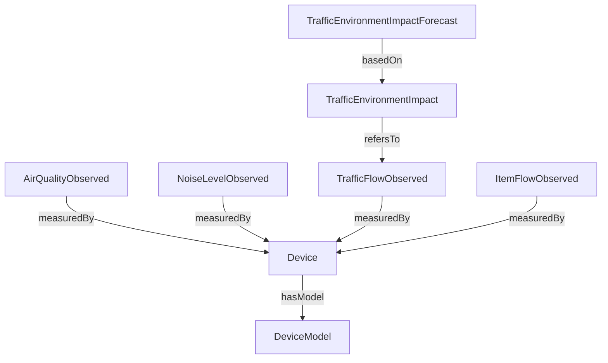

# Data Model - UrbanPulse Coruna (NGSI-LD)

## 1. Objetivo del modelo de datos
Este documento define el modelo de datos NGSI-LD de UrbanPulse Coruna para monitorizacion ambiental y movilidad urbana. Se describen 8 entidades FIWARE con enfoque operativo para A Coruna, separando:
- Tipo de entidad.
- Atributos estaticos (catalogo, configuracion o contexto fijo).
- Atributos dinamicos IoT (telemetria y medidas temporales).
- Relaciones NGSI-LD `Relationship` entre entidades.

## 2. Convenciones NGSI-LD usadas

- Todas las entidades usan `id` URN y `type` oficial del Smart Data Model.
- Atributos medibles se representan como `Property`.
- Geolocalizacion se representa como `GeoProperty` en `location`.
- Relaciones entre entidades se representan como `Relationship` con `object`.
- Se usa Orion-LD como Context Broker de referencia.

Ejemplo de patron de relacion:

```json
"measuredBy": {
  "type": "Relationship",
  "object": "urn:ngsi-ld:Device:coruna:sensor-002"
}
```

## 3. Entidades

## 3.1 TrafficFlowObserved

### Tipo
- `type`: `TrafficFlowObserved`

### Rol en UrbanPulse
Representa flujo vehicular observado por tramo vial real de A Coruna para correlacionarlo con contaminacion y ruido.

### Atributos estaticos (ejemplos reales)
- `id`: `urn:ngsi-ld:TrafficFlowObserved:coruna:avda-finisterre:lane-1`
- `name`: `Flujo vehicular Avda. de Finisterre - carril principal`
- `laneId`: `avda-finisterre-l1`
- `laneDirection`: `inbound`
- `location` (GeoProperty): tramo de Avda. de Finisterre cercano a 43.3713, -8.4194
- `dataProvider`: `UrbanPulse Coruna`

### Atributos dinamicos IoT
- `dateObserved`
- `dateObservedFrom`
- `dateObservedTo`
- `intensity` (veh/h)
- `occupancy` (porcentaje ocupacion)
- `averageSpeed` (km/h)
- `maxSpeed` (km/h)
- `minSpeed` (km/h)

### Relaciones NGSI-LD
- `measuredBy` -> `Device`
  - Ejemplo: `urn:ngsi-ld:Device:coruna:sensor-001`

## 3.2 ItemFlowObserved

### Tipo
- `type`: `ItemFlowObserved`

### Rol en UrbanPulse
Mide flujo peatonal y ciclista para deteccion de eventos masivos y para el calculo de presion urbana.

### Atributos estaticos (ejemplos reales)
- `id`: `urn:ngsi-ld:ItemFlowObserved:coruna:cuatro-caminos:ped-bike`
- `name`: `Flujo peatonal y ciclista Cuatro Caminos`
- `itemType`: `person`
- `itemSubType`: `pedestrian,bicycle`
- `location` (GeoProperty): entorno de Cuatro Caminos (43.3698, -8.4089)
- `dataProvider`: `UrbanPulse Coruna`

### Atributos dinamicos IoT
- `dateObserved`
- `dateObservedFrom`
- `dateObservedTo`
- `intensity` (items/h)
- `averageSpeed` (km/h)
- `occupancy` (porcentaje)
- `congested` (boolean)

### Relaciones NGSI-LD
- `measuredBy` -> `Device`
  - Ejemplo: `urn:ngsi-ld:Device:coruna:sensor-003`

## 3.3 TrafficEnvironmentImpact

### Tipo
- `type`: `TrafficEnvironmentImpact`

### Rol en UrbanPulse
Sintetiza impacto ambiental por zona/tramo combinando evidencia de trafico y variables ambientales para operacion EcoZones.

### Atributos estaticos (ejemplos reales)
- `id`: `urn:ngsi-ld:TrafficEnvironmentImpact:coruna:ronda-outeiro:zone-a`
- `name`: `Impacto ambiental Ronda de Outeiro`
- `description`: `Impacto agregado en zona periurbana de alta carga circulatoria`
- `location` (GeoProperty): zona Ronda de Outeiro (43.3687, -8.4071)
- `source`: `UrbanPulse fusion model`
- `dataProvider`: `UrbanPulse Coruna`

### Atributos dinamicos IoT
- `dateObservedFrom`
- `dateObservedTo`
- `traffic` (Property compuesto por clase de vehiculo con intensidad, velocidad y ocupacion)
- `impactScore` (indice interno de impacto)
- `persistedOver2h` (boolean para deteccion de zona critica)

### Relaciones NGSI-LD
- `refersTo` -> `TrafficFlowObserved`
  - Ejemplo: `urn:ngsi-ld:TrafficFlowObserved:coruna:ronda-outeiro:lane-2`

## 3.4 TrafficEnvironmentImpactForecast

### Tipo
- `type`: `TrafficEnvironmentImpactForecast`

### Rol en UrbanPulse
Prediccion del impacto ambiental para horizontes 6/12/24 horas y soporte a simulacion de ZBE.

### Atributos estaticos (ejemplos reales)
- `id`: `urn:ngsi-ld:TrafficEnvironmentImpactForecast:coruna:ronda-outeiro:2026-04-21`
- `name`: `Forecast impacto ambiental Ronda de Outeiro`
- `description`: `Prediccion ML para escenarios 6h/12h/24h`
- `location` (GeoProperty): Ronda de Outeiro (43.3687, -8.4071)
- `dataProvider`: `UrbanPulse Coruna ML`

### Atributos dinamicos IoT
- `dateIssued`
- `validFrom`
- `validTo`
- `horizon` (6h, 12h, 24h)
- `predictedNO2` (ug/m3)
- `predictedPM25` (ug/m3)
- `predictedImpactScore`
- `confidenceLow`
- `confidenceHigh`

### Relaciones NGSI-LD
- `basedOn` -> `TrafficEnvironmentImpact`
  - Ejemplo: `urn:ngsi-ld:TrafficEnvironmentImpact:coruna:ronda-outeiro:zone-a`

## 3.5 AirQualityObserved

### Tipo
- `type`: `AirQualityObserved`

### Rol en UrbanPulse
Representa observaciones de contaminacion atmosferica para correlacion, prediccion y alertado.

### Atributos estaticos (ejemplos reales)
- `id`: `urn:ngsi-ld:AirQualityObserved:coruna:ronda-outeiro:station-1`
- `name`: `Calidad del aire Ronda de Outeiro`
- `areaServed`: `Ronda de Outeiro`
- `location` (GeoProperty): 43.3687, -8.4071
- `dataProvider`: `UrbanPulse Coruna`

### Atributos dinamicos IoT
- `dateObserved`
- `no2` (ug/m3)
- `pm25` (ug/m3)
- `o3` (ug/m3)
- `co` (mg/m3)
- `airQualityIndex`
- `airQualityLevel`

Ejemplo de valor real de contexto:
- `no2 = 89 ug/m3` en Ronda de Outeiro (episodio de pico).

### Relaciones NGSI-LD
- `measuredBy` -> `Device`
  - Ejemplo: `urn:ngsi-ld:Device:coruna:sensor-002`

## 3.6 NoiseLevelObserved

### Tipo
- `type`: `NoiseLevelObserved`

### Rol en UrbanPulse
Representa contaminacion acustica para analitica urbana, alertado y calculo combinado con trafico/aire.

### Atributos estaticos (ejemplos reales)
- `id`: `urn:ngsi-ld:NoiseLevelObserved:coruna:avda-finisterre:sonometer-1`
- `name`: `Ruido urbano Avda. de Finisterre`
- `sonometerClass`: `Class-1`
- `location` (GeoProperty): 43.3713, -8.4194
- `dataProvider`: `UrbanPulse Coruna`

### Atributos dinamicos IoT
- `dateObservedFrom`
- `dateObservedTo`
- `LAeq` (dB(A))
- `LAmax` (dB(A))
- `LAS` (dB(A))
- `noiseIndex`

### Relaciones NGSI-LD
- `measuredBy` -> `Device`
  - Ejemplo: `urn:ngsi-ld:Device:coruna:sensor-001`

## 3.7 Device

### Tipo
- `type`: `Device`

### Rol en UrbanPulse
Describe sensor IoT fisico/virtual que produce medidas de trafico, aire o ruido.

### Atributos estaticos (ejemplos reales)
- `id`: `urn:ngsi-ld:Device:coruna:sensor-001`
- `name`: `sensor-001 Avda. de Finisterre`
- `category`: `environmentalSensor`
- `controlledProperty`: `trafficFlow,airQuality,noiseLevel`
- `modelName`: `UrbanPulse-MultiSensor-v1`
- `manufacturerName`: `UrbanPulse Lab`
- `serialNumber`: `UP-COR-001`
- `location` (GeoProperty): 43.3713, -8.4194

### Atributos dinamicos IoT
- `deviceState` (online/offline)
- `dateLastValueReported`
- `rssi`
- `batteryLevel` (si aplica)

### Relaciones NGSI-LD
- `hasModel` -> `DeviceModel`
  - Ejemplo: `urn:ngsi-ld:DeviceModel:coruna:multisensor-v1`

## 3.8 DeviceModel

### Tipo
- `type`: `DeviceModel`

### Rol en UrbanPulse
Define plantilla tecnica reutilizable de sensores para normalizar capacidades, protocolos y unidades.

### Atributos estaticos (ejemplos reales)
- `id`: `urn:ngsi-ld:DeviceModel:coruna:multisensor-v1`
- `name`: `Modelo multisensor urbano Coruna v1`
- `brandName`: `UrbanPulse`
- `modelName`: `multisensor-v1`
- `manufacturerName`: `UrbanPulse Lab`
- `category`: `environmentalSensor`
- `supportedProtocol`: `MQTT,HTTP`
- `supportedUnits`: `ug/m3,dB(A),veh/h,km/h`
- `controlledProperty`: `no2,pm25,o3,co,laeq,intensity,averageSpeed`

### Atributos dinamicos IoT
DeviceModel es principalmente catalogo tecnico. Puede actualizar:
- `dateModified`
- `firmwareVersionReference`

### Relaciones NGSI-LD
- Relacion inversa esperada desde `Device.hasModel`.

## 4. Mapeo de sensores reales de A Coruna

| Sensor | Ubicacion | Lat | Lon | Zona |
|---|---|---:|---:|---|
| sensor-001 | Avda. de Finisterre | 43.3713 | -8.4194 | Alto trafico |
| sensor-002 | Ronda de Outeiro | 43.3687 | -8.4071 | Ronda periurbana |
| sensor-003 | Cuatro Caminos | 43.3698 | -8.4089 | Nodo transporte |
| sensor-004 | Paseo Maritimo | 43.3714 | -8.3967 | Costa, baja contaminacion |
| sensor-005 | Torre Hercules | 43.3858 | -8.4066 | Referencia historica |
| sensor-006 | Monte San Pedro | 43.3782 | -8.4397 | Zona verde periferica |

## 5. Diagrama de relaciones entre entidades (Mermaid)



## 6. Reglas de validacion semantica

- Todos los `id` deben ser URN NGSI-LD.
- Todas las entidades deben incluir `type` correcto.
- Todas las relaciones deben usar `type: Relationship` y `object` valido.
- Los atributos dinamicos deben llevar marca temporal de observacion o emision.
- Las unidades deben ser consistentes:
  - NO2, PM2.5, O3 en ug/m3.
  - CO en mg/m3.
  - Ruido en dB(A).
  - Flujo en veh/h o items/h.

## 7. Trazabilidad con funcionalidades

- F1/F2: consumo principal de TrafficFlowObserved, AirQualityObserved, NoiseLevelObserved e ItemFlowObserved.
- F3: genera TrafficEnvironmentImpactForecast a partir de historicos e impacto observado.
- F4/F6: explicaciones y alertas sobre entidades ambientales e impacto.
- F7: consumo simplificado de indicadores para interfaz ciudadana.

## 8. Cobertura de suscripcion Orion-LD -> QuantumLeap

La infraestructura base define una suscripcion NGSI-LD para historizacion que cubre todas las entidades del modelo:

- TrafficFlowObserved
- ItemFlowObserved
- TrafficEnvironmentImpact
- TrafficEnvironmentImpactForecast
- AirQualityObserved
- NoiseLevelObserved
- Device
- DeviceModel

Artefactos de implementacion:
- `services/subscriptions/orion_to_quantumleap_all_entities.json`
- `services/create_orion_subscription.sh`

Con esta cobertura, cualquier actualizacion de entidades en Orion-LD puede fluir hacia QuantumLeap y persistirse en CrateDB para analitica historica.
